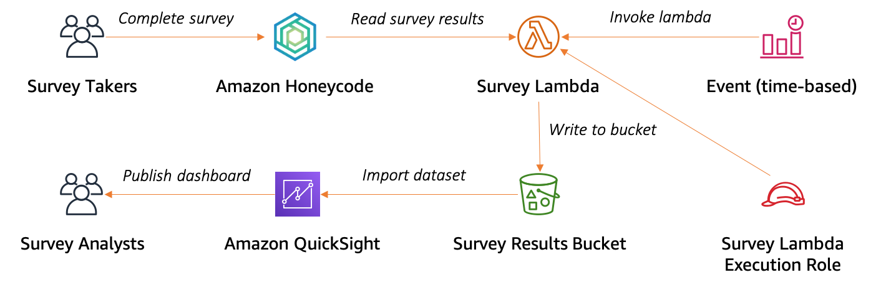

# Use Amazon QuickSight to visualize data from Amazon Honeycode

By Kandha Sankarapandian, *Senior Solutions Architect*

[Amazon Honeycode](https://www.honeycode.aws/?trk=el_a134p000006gNooAAE&trkCampaign=pac-edm-2020-honeycode-homepage&sc_channel=el&sc_campaign=pac-edm-2020-honeycode-website_links-adoption-quicksight_post_link&sc_outcome=Enterprise_Digital_Marketing&sc_geo=NAMER&sc_country=US) gives you the power to build custom apps without programming. Honeycode apps are built in four simple steps: 

1. Organize your data in Tables.
2. Build apps using the drag-and-drop App Builder.
3. Use Automations to replace manual steps in your process.
4. Share your apps with your team. 

Honeycode lets you get started quickly by using an app template or by importing your existing data in CSV files. To export data from Honeycode, you can copy and paste from your Honeycode Tables. 

Honeycode can be used across many different industries and fields and still have the same effect or end goal. What if you’re a Human Resources manager who wants to synchronize employee data from an external system? Or if you’re a compliance officer for a financial firm and want to keep snapshots of your Honeycode data for data retention purposes? How about a retail store manager who wants to visualize and analyze the data you’ve collected in Honeycode using your business intelligence tool? **The answer: Amazon Honeycode API**. Honeycode APIs allow you to extend Honeycode beyond its existing capabilities but they do require IT level skills to set them up.

In this post I show how to use two of Honeycode’s APIs:

* **GetScreenData:** Reads data from a Honeycode app screen 
* **InvokeScreenAutomation:** Invokes an action defined in a Honeycode app screen such as adding, overwriting, and deleting data

>Tip: If you would like to learn about and use Honeycode's Table level APIs, refer to the related sample code repo here: [Amazon Honeycode Table API Integration Sample](https://github.com/aws-samples/amazon-honeycode-table-api-integration-sample)

## Prerequisite

If you don’t have one already, [create a new Honeycode account](https://www.honeycode.aws/?trk=el_a134p000006gNooAAE&trkCampaign=pac-edm-2020-honeycode-homepage&sc_channel=el&sc_campaign=pac-edm-2020-honeycode-website_links-adoption-quicksight_post_link&sc_outcome=Enterprise_Digital_Marketing&sc_geo=NAMER&sc_country=US) and log in. To get started with the Honeycode APIs, [link your Honeycode team with your AWS account](https://honeycodecommunity.aws/t/connecting-honeycode-to-an-aws-account/98)

## Overview

In this post, I look at how to set up a survey app using Amazon Honeycode. I show how to write the survey results to an [Amazon S3](https://aws.amazon.com/s3/) bucket using an [AWS Lambda](https://aws.amazon.com/lambda/) function. Finally, I visualize the survey results data using [Amazon QuickSight](https://aws.amazon.com/quicksight/). Here’s an overview of the architecture: 

## Create a survey app using Amazon Honeycode

Honeycode provides templates for a number of common use cases. Using a [Honeycode template](https://www.honeycode.aws/templates) creates a workbook with the required tables to store the data, in addition to apps and automations with the basic functionality for that use case. You can then customize the app to meet your needs.

Use the [Simple Survey template](https://www.honeycode.aws/templates/simple-survey) to create a new workbook. Next, update the **Survey** table data model by adding an additional column, ‘In S3’. You use this column to indicate if a row of survey results is stored in the S3 bucket. You then use the same column to create an automation that deletes survey results older than a month, after being stored in the S3 bucket.

This allows you to keep your Honeycode tables current and store historical data in cost-effective, long-term storage options, such as Amazon S3 and [Amazon S3 Glacier](https://aws.amazon.com/glacier/). Next, you create another Honeycode app, Survey API, with a user interface to read new survey results and to update existing survey results. Follow along with the instructional video to create this app in your own Honeycode account.

[](https://www.youtube.com/watch?v=2tvib8391OQ)

## Creating a serverless API to read and write data from Amazon Honeycode

In this section, you create a serverless API. This reads the survey results from the Honeycode app using GetScreenData API and stores the data in S3. You then update the In S3 column in Honeycode with the current time by using the InvokeScreenAutomation API.

This section uses the [AWS CDK](https://aws.amazon.com/cdk/) to deploy the serverless API components and policies. AWS CDK allows you to manage infrastructure using code. The application includes:

* The Survey Lambda function that reads and writes the data.
* The survey-results S3 bucket where the survey results are stored in CSV format.
* The SurveyTimer [Amazon EventBridge](https://aws.amazon.com/eventbridge/) event that triggers the Survey Lambda function every hour.

> Note: In the video below we make use of [AWS Cloud9](https://aws.amazon.com/cloud9/) to deploy our API application. AWS Cloud9 is a cloud-based integrated development environment (IDE) that lets you write, run, and debug your code with just a browser. It includes a code editor, debugger, and terminal. You can use the default configuration when creating a Cloud9 environment. If you’d like to use your own machine for deploying the API application, you can do so by following the instructions to [install and configure AWS CDK](https://docs.aws.amazon.com/cdk/latest/guide/getting_started.html#getting_started_prerequisites) and using the following commands:

```
npm install
cdk bootstrap
cdk deploy
```

Survey API Application source: https://github.com/aws-samples/amazon-honeycode-quicksight-integration-sample

[](https://www.youtube.com/watch?v=LV3FEG6O6H8)

## Create an Amazon QuickSight Dashboard to visualize the survey results

In this section, you use [Amazon QuickSight](https://aws.amazon.com/quicksight/) to visualize the survey results. Amazon QuickSight is an analytics service that you can use to create datasets, perform one-time analyses, and build visualizations and dashboards.

First, create a new Amazon QuickSight dataset to read the JSON files stored in the S3 bucket. Then use that dataset to create a visualization of the survey results. Finally, publish the visualization as a dashboard to be shared with other users.

[](https://www.youtube.com/watch?v=uVx-Ni7bgE4)

## Cleanup

You can remove the serverless API application by running the following command in the AWS Cloud9 IDE:

```
cdk destroy
```

## Summary

In this post, you created a survey application in Amazon Honeycode. You use Honeycode’s API to read and write data using a serverless API and finally you visualize the survey results using Amazon QuickSight. The possibilities in Honeycode are virtually endless. Let us know what you think in the comments!

*Not yet a Honeycode customer? [Sign up for the free version here](https://www.honeycode.aws/?trk=el_a134p000006gNooAAE&trkCampaign=pac-edm-2020-honeycode-homepage&sc_channel=el&sc_campaign=pac-edm-2020-honeycode-website_links-adoption-quicksight_post_link&sc_outcome=Enterprise_Digital_Marketing&sc_geo=NAMER&sc_country=US)*.
